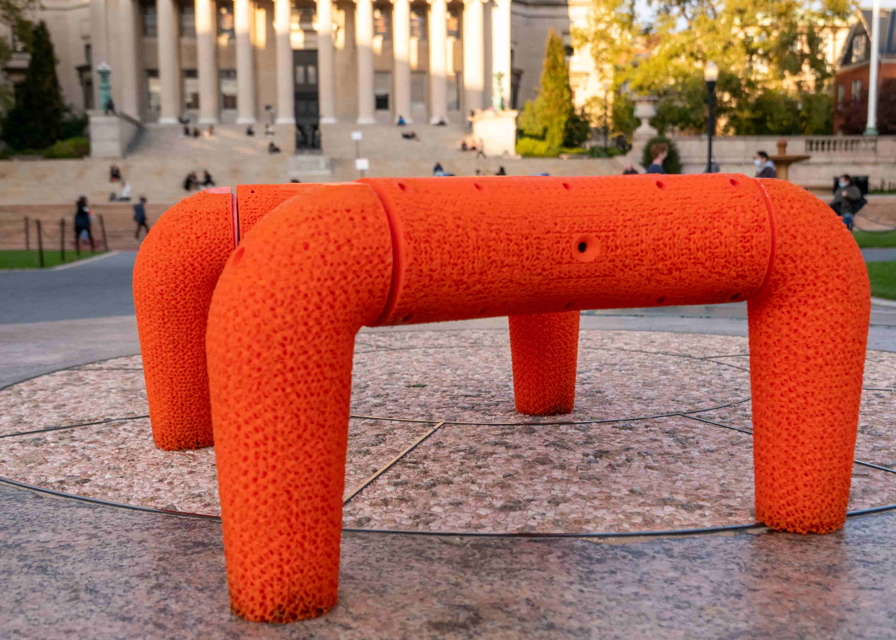

<!-- ---
title:A Legged Soft Robot Platform for Dynamic Locomotion
--- -->
	

Abstract—We present an open-source untethered quadrupedal soft robot platform for dynamic locomotion (e.g., high-speed running and backflipping). The robot is mostly soft (80 vol.%) while driven by four geared servo motors. The robot’s soft body and soft legs were 3D printed with gyroid infill using a flexible material, enabling it to conform to the environment and passively stabilize during locomotion on multi-terrain environments. In addition, we simulated the robot in a real-time soft body simulation. With tuned gaits in simulation, the real robot can locomote at a speed of 0.9 m/s (2.5 body length/second), substantially faster than most untethered legged soft robots published to date. We hope this platform, along with its verified simulator, can catalyze the development of soft robotics.

### Github
[Hardware](https://github.com/boxiXia/FlexipodHardware){:target="_blank"}
&nbsp;&nbsp;|&nbsp;&nbsp;
[Software](https://github.com/boxiXia/FlexipodFast){:target="_blank"}

### Video summary



### Flexipod locomotion in the wild



### People
[Boxi Xia](https://github.com/boxiXia), [Hongbo Zhu](https://github.com/DonovanZhu), [Zhicheng Song](https://github.com/ZhichengSong6), Yibo Jiang,Jiaming Fu, [Hod Lipson](https://www.hodlipson.com/)