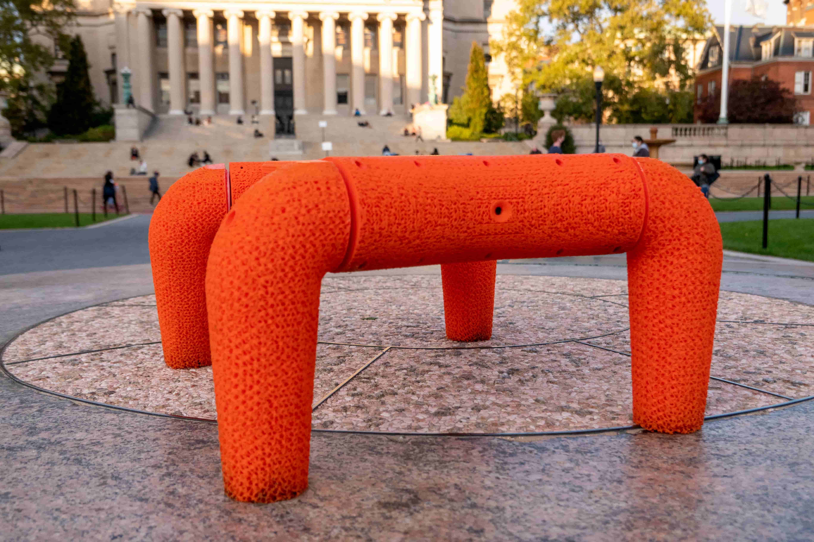

<h1 style="border-style: none; margin: 0px; padding: 0px; text-align: center">Flexipod:</h1>
<h2 style="border-style: none; margin: 0px; padding: 0px; text-align: center">A Legged Soft Robot Platform for Dynamic Locomotion</h2>

  

    

    

    

    

    

    

    

  

  

  

<!-- 

	 -->

<!-- 
 -->
Abstract—We present an open-source untethered quadrupedal soft robot platform for dynamic locomotion (e.g., high-speed running and backflipping). The robot is mostly soft (80 vol.%) while driven by four geared servo motors. The robot’s soft body and soft legs were 3D printed with gyroid infill using a flexible material, enabling it to conform to the environment and passively stabilize during locomotion on multi-terrain environments. In addition, we simulated the robot in a real-time soft body simulation. With tuned gaits in simulation, the real robot can locomote at a speed of 0.9 m/s (2.5 body length/second), substantially faster than most untethered legged soft robots published to date. We hope this platform, along with its verified simulator, can catalyze the development of soft robotics. 
<!-- 
 -->

<!-- Github <i class="fab fa-github"></i>:  -->
<a class="button button--success button--rounded button--md" href="https://github.com/boxiXia/FlexipodHardware" target="_blank"><i class="fab fa-github"></i> Hardware</a> 
<a class="button button--success button--rounded button--md" href="https://github.com/boxiXia/FlexipodFast" target="_blank"><i class="fab fa-github"></i> Simulation</a> 
<!-- [Hardware](https://github.com/boxiXia/FlexipodHardware){:target="_blank"}
&nbsp; &nbsp; |&nbsp; &nbsp; 
[Simulation](https://github.com/boxiXia/FlexipodFast){:target="_blank"} -->
<a class="button button--success button--rounded button--md" href="./assets/flexipod_paper.pdf" target="_blank"><i class="fas fa-download"></i> paper</a>

### Paper video



### Material

The flexible material used for printing the soft body and legs is a flexible TPU(Cheetah flexible filament, Ninjatek). Although the filament has a shore hardness of 95A, it is possible to achieve a lower hardness by varying the infill density and the flow rate (the percentage of the material extruded). 

(a) Shore hardness vs. flow rate and infill density; (b-c) 3d printed cross-section of (b) gyroid 20% infill density and 90% flow rate, and (c) with 16% infill density and 80% flow rate.

### Body design
The body is printed with the flexible material. 96 vol. % of the 3D printed parts of the robot are soft, making the robot is 80 vol.% soft. 

Structure of the soft robot: (1) Soft main body; (2) Camera; (3) Electronic components; (4) Li-Po battery; (5) Bearing; (6) DJI M3508 brushless DC motor enclosed in a motor shell; (7) Soft leg. 

### Soft leg
The leg’s hollowed structure makes the it flexible and impact resistant. To demonstrate its damping effect, we dropped the Flexipod from as high as 2.0 m height. At impact, the soft legs were compressed, and the body was bent inward to absorb the impact. Thus, the Flexipod is able to recover from the fall on its own.
<!-- 

 -->

 

  

Flexipod soft leg and demonstration: (a) Soft Leg, leg coupler and bearing; (b) 3D model of the leg assembly showing its internal structure; (c) chronophotograph of the Flexipod dropped from 2.0 m.

### Simulation

<!-- ### [Simulation](https://github.com/boxiXia/FlexipodFast){:target="_blank"} -->
We developed a soft robot simulation environment based on the [Titan](https://github.com/jacobaustin123/Titan) -- CUDA accelerated massively parallel asynchronous spring-mass simulation library. We extended the Titan library with a rotational kernel for contact-coupling of soft bodies. The Flexipod simulation achieved 10^9 spring evaluations per second on a consumer Nvidia 2080Ti GPU.



### locomotion patterns

(a) bounding gait, (b) pace gait, (c) turning, (d) backflip

### More backflips



### locomotion in the wild



### People

[Boxi Xia](https://github.com/boxiXia), [Hongbo Zhu](https://github.com/DonovanZhu), [Zhicheng Song](https://github.com/ZhichengSong6), [Yibo Jiang](https://github.com/YiboJ12), [Jiaming Fu](https://github.com/fuj2015), [Hod Lipson](https://www.hodlipson.com/)

[Creative Machines Lab](https://www.creativemachineslab.com/) at Columbia University
